# TIS-100_Raiders

解法基本都是自己设计，个别谜题参考了网上其它人的答案，而且没有优化，因此数据并不优秀，仅可完成关卡目标

剧情部分翻译暂不完整

## SELF-TEST DIAGNOSTIC(自检诊断)(00150)

### 目标

- 从IN.X读入值然后写到OUT.X
- 从IN.A读入值然后写到OUT.A

### 剧情

> —计算节点检测—微码转储—
>
> 1C15/SA.64 现在无法找到笔，所以在这里我要记笔记。 看起来像短期存储
>
> 05/10/79 ——今天在交换会上得到了这个。Fella想要450美元但我砍到了200美元。好买卖！！！不知道是谁制造的它。TIS系列和体系结构的新奇闻所未闻。
>
> Randy的手上有个谜题！！

### 解法

| CYCLE | NODE | INSTRUCTION |
| ----- | ---- | ----------- |
| 83    | 8    | 8           |

## SIGNAL AMPLIFIER(信号放大器)(10981)

### 目标

- 从IN.A读入值

- 让值变为两倍

- 将值写到OUT.A

### 剧情

> —计算节点检测—微码转储—
>
> 07/18/1979 ——仍在困惑....... 和Bernie在IBM聊天时他说这听起来像是苏联的O_N.A.. 但那为什么手册是用英语写的？？

### 解法

| CYCLE | NODE | INSTRUCTION |
| ----- | ---- | ----------- |
| 160   | 4    | 6           |

## DIFFERENTIAL CONVERTER(差动转换器)(20176)

### 目标

- 从IN.A和IN.B读入值
- 把IN.A-IN.B写到OUT.P
- 把IN.B-IN.A写到OUT.N

### 剧情

>—计算节点检测—微码转储—
>
>07/19/1979 ——真有意思。它看起来I.V.D$I.@SI 有某种静态内存在这个东西里面。被编码了一些东西或者别的什么。

### 解法

| CYCLE | NODE | INSTRUCTION |
| ----- | ---- | ----------- |
| 201   | 5    | 11          |

## SIGNAL COMPARATOR(信号比较器)(21340)

### 目标

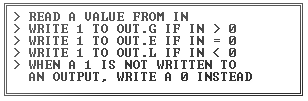

- 从IN读入一个值
- 如果IN>0就向OUT.G写入1
- 如果IN=0就向OUT.E写入1
- 如果IN<0就向OUT.L写入1
- 如果某个输出没有被写入1，则用0代替

### 剧情

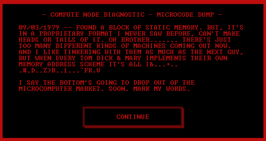

>—计算节点检测—微码转储—
>
>09/03/1979 ——在静态内存中发现了一个块。但是，它是我从未见过的专有格式，找不到它的头和尾。哦兄弟....... 现在有太多种类的机器问世了。我喜欢和它们修补就像下一个兄弟，但是当Tom Dick和Mary的实现他们自己的内存地址方案这全都我&...+...#.D..Z>R..1...`FK.V
>
>下面的会被从计算机市场撤下来，记住我说的话。

### 解法

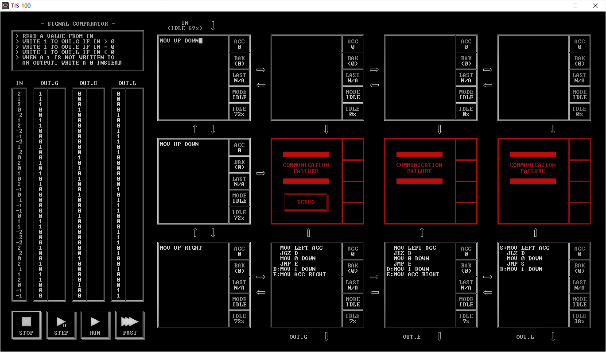

| CYCLE | NODE | INSTRUCTION |
| ----- | ---- | ----------- |
| 283   | 6    | 20          |

## SIGNAL MULTIPLEXER(信号多路复用器)(22280)

### 目标

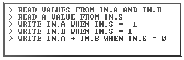

- 从IN.A和IN.B读入数据
- 从IN.S读入数据
- IN.S=-1时输出IN.A
- IN.S=1时输出IN.B
- IN.S=0时输出IN.A+IN.B

### 剧情

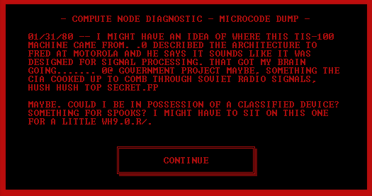

### 解法

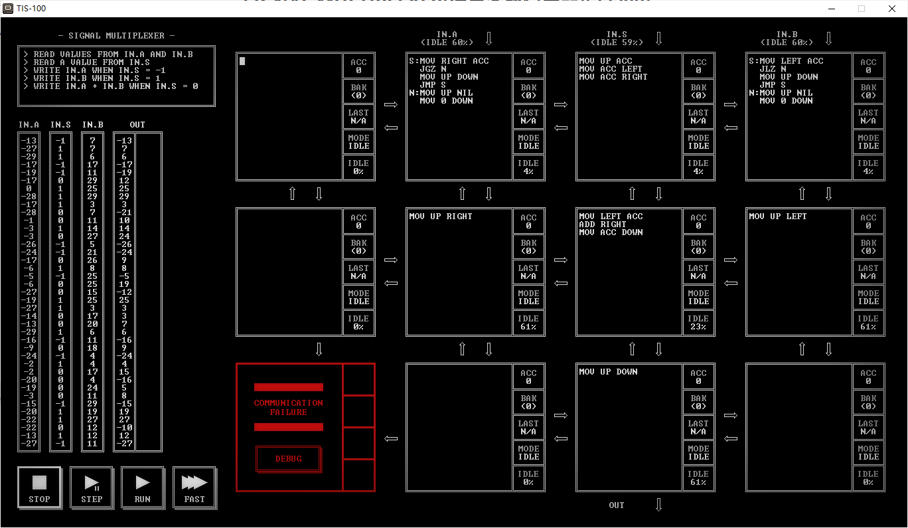

| CYCLE | NODE | INSTRUCTION |
| ----- | ---- | ----------- |
| 204   | 7    | 21          |

## SEQUENCE GENERATOR(序列发生器)(30647)

### 目标

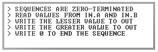

- 序列使用0结束
- 从IN.A和IN.B读入值
- 向OUT写入较小的值
- 向OUT写入较大的值
- 向序列末尾写入0

### 剧情

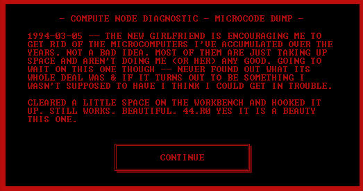

### 解法

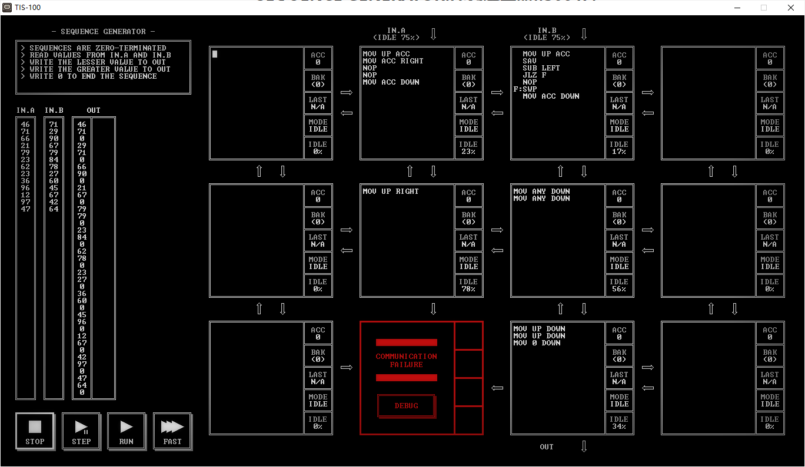

| CYCLE | NODE | INSTRUCTION |
| ----- | ---- | ----------- |
| 126   | 5    | 18          |

## SEQUENCE COUNTER(序列计数器)(31904)

### 目标

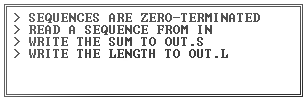

- 序列使用0结束
- 从IN读入一个序列
- 向OUT.S写入和
- 向OUT.L写入长度

### 剧情

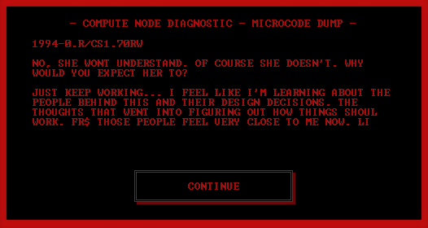

### 解法

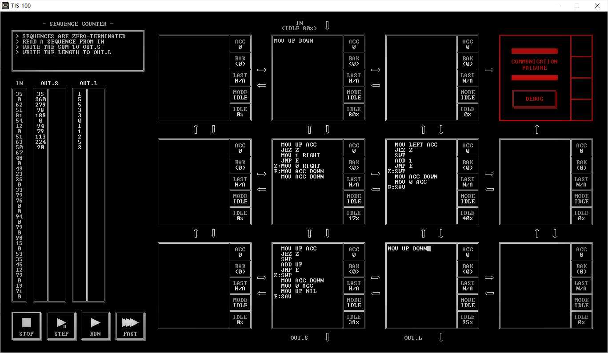

| CYCLE | NODE | INSTRUCTION |
| ----- | ---- | ----------- |
| 122   | 5    | 28          |

## SIGNAL EDGE DETECTOR(信号边沿检测器)(32050)

### 目标

- 从IN读入一个值
- 和上一个值进行比较
- 如果变化超过10则写入1
- 如果没有，写入0
- 第一个输出总是0

### 剧情

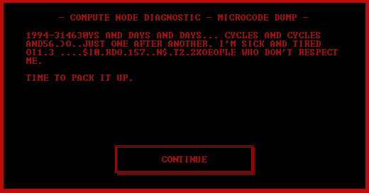

### 解法

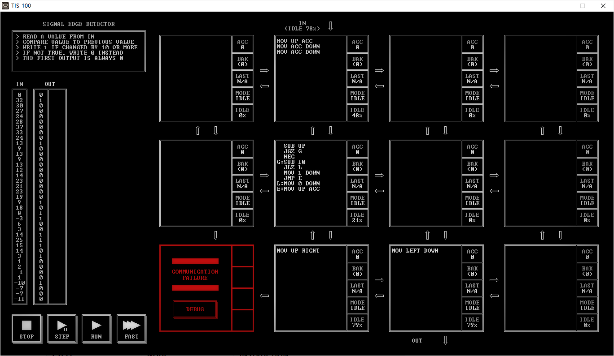

| CYCLE | NODE | INSTRUCTION |
| ----- | ---- | ----------- |
| 385   | 4    | 14          |

## INTERRUPT HANDLER(中断处理程序)(33762)

### 目标

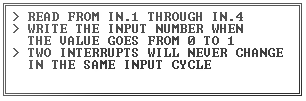

- 从IN.1到IN.4读入数据
- 当值从0变为1时写入对应的输入号
- 两个中断永远不会在同一个输入周期发生

### 剧情

### 解法

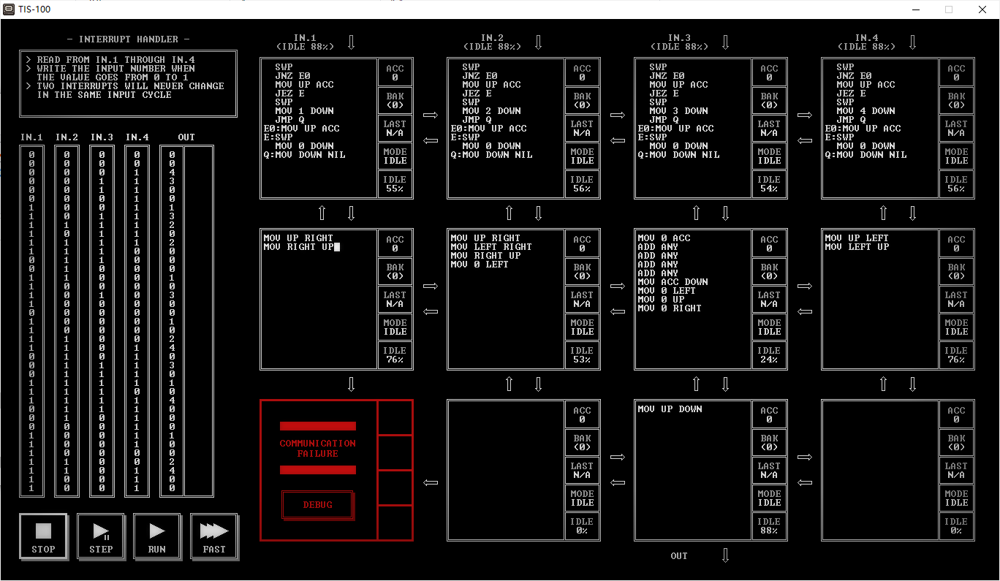

| CYCLE | NODE | INSTRUCTION |
| ----- | ---- | ----------- |
| 671   | 9    | 62          |

## SIGNAL PATTERN DETECTOR(信号模式检测器)(40196)

### 目标

- 从IN读入一个值
- 寻找序列0,0,0
- 找到序列时输出1
- 如果没有，输出0

### 剧情

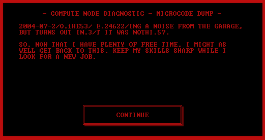

### 解法

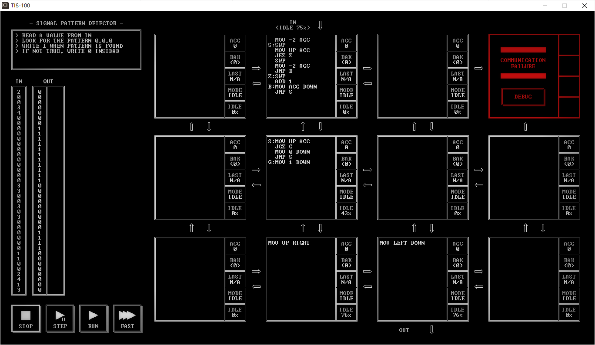

| CYCLE | NODE | INSTRUCTION |
| ----- | ---- | ----------- |
| 336   | 4    | 18          |

## SEQUENCE REVERSER(倒序器)(42656)

### 目标

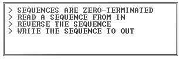

- 序列使用0结束
- 从IN读入一个序列
- 将序列倒序
- 向OUT写入序列

### 剧情

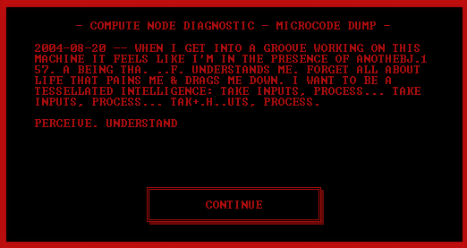

### 解法

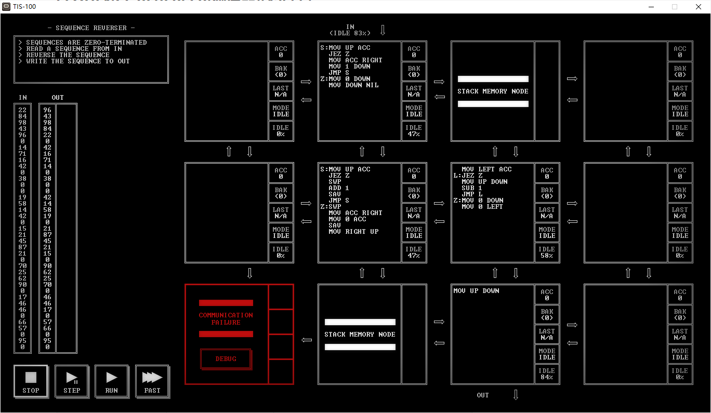

| CYCLE | NODE | INSTRUCTION |
| ----- | ---- | ----------- |
| 501   | 4    | 26          |

## SIGNAL MULTIPLIER(信号乘法器)(43786)

### 目标

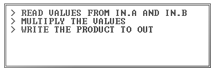

- 从IN.A和IN.B读入数据
- 两值相乘
- 向OUT写入结果

### 剧情

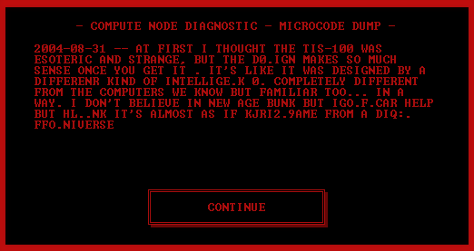

### 解法

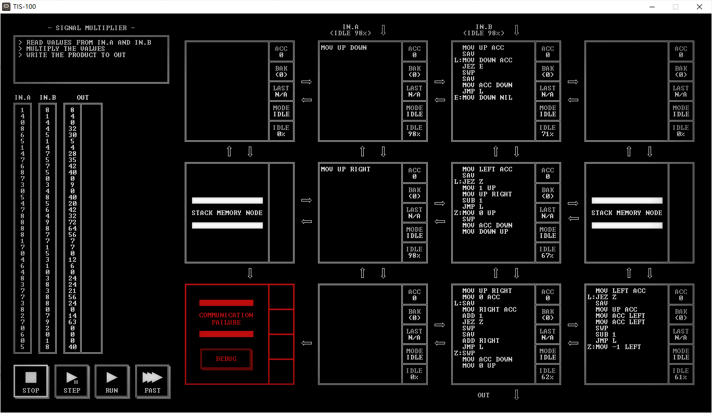

| CYCLE | NODE | INSTRUCTION |
| ----- | ---- | ----------- |
| 5244  | 6    | 45          |

## IMAGE TEST PATTERN 1(图像测试样式1)(50370)

### 目标

- 使用指定的目标测试样式填充图像缓冲区

### 剧情

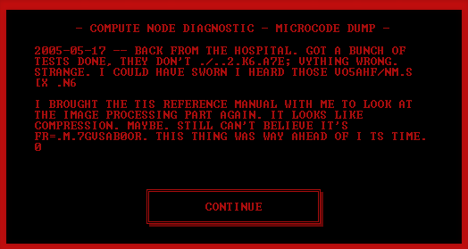

### 解法

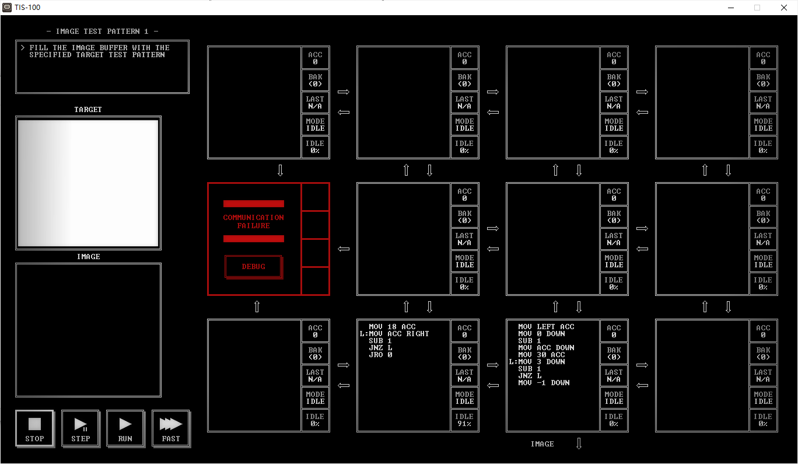

| CYCLE | NODE | INSTRUCTION |
| ----- | ---- | ----------- |
| 2320  | 2    | 14          |

## IMAGE TEST PATTERN 2(图像测试样式2)(51781)

### 目标

- 使用指定的目标测试样式填充图像缓冲区

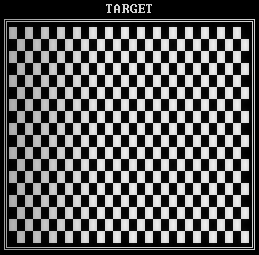

### 剧情

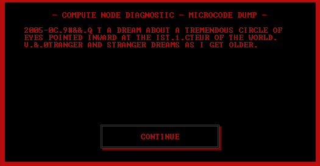

### 解法

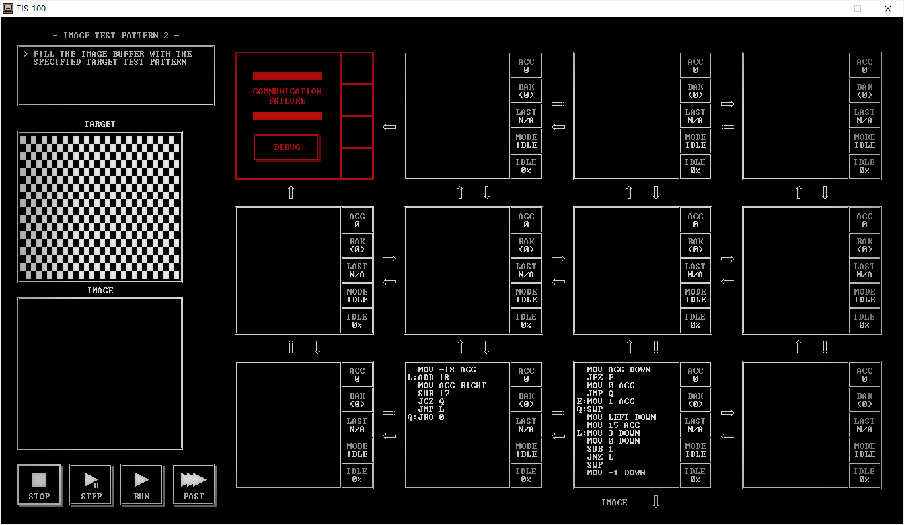

| CYCLE | NODE | INSTRUCTION |
| ----- | ---- | ----------- |
| 1820  | 2    | 21          |

