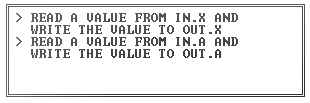

# TIS-100_Raiders

目前仅基础关部分，解法基本都是自己设计，个别谜题参考了网上其它人的答案，因此数据并不优秀，仅可完成关卡目标

## SELF-TEST DIAGNOSTIC(自检诊断)(00150)

### 目标

- 从IN.X读入值然后写道OUT.X
- 从IN.A读入值然后写道OUT.A

### 剧情

> —计算节点检测—微码转储—
>
> 1C15/SA.64 现在无法找到笔，所以在这里我要记笔记。 看起来像短期存储
>
> 05/10/79 ——今天在交换会上得到了这个。Fella想要450美元但我砍到了200美元。好买卖！！！不知道是谁制造的它。TIS系列和体系结构的新奇闻所未闻。
>
> Randy的手上有个谜题！！

### 解法

| CYCLE | NODE | INSTRUCTION |
| ----- | ---- | ----------- |
| 83    | 8    | 8           |

## SIGNAL AMPLIFIER(信号放大器)(10981)

### 目标

- 从IN.A读入值

- 让值变为两倍

- 将值写到OUT.A

### 剧情

> —计算节点检测—微码转储—
>
> 07/18/1979 ——仍在困惑....... 和Bernie在IBM聊天时他说这听起来像是苏联的O_N.A.. 但那为什么手册是用英语写的？？

### 解法

| CYCLE | NODE | INSTRUCTION |
| ----- | ---- | ----------- |
| 160   | 4    | 6           |

## DIFFERENTIAL CONVERTER(差动转换器)(20176)

### 目标

- 从IN.A和IN.B读入值
- 把IN.A-IN.B写到OUT.P
- 把IN.B-IN.A写到OUT.N

### 剧情

>—计算节点检测—微码转储—
>
>07/19/1979 ——真有意思。它看起来I.V.D$I.@SI 有某种静态内存在这个东西里面。被编码了一些东西或者别的什么。

### 解法

| CYCLE | NODE | INSTRUCTION |
| ----- | ---- | ----------- |
| 201   | 5    | 11          |

